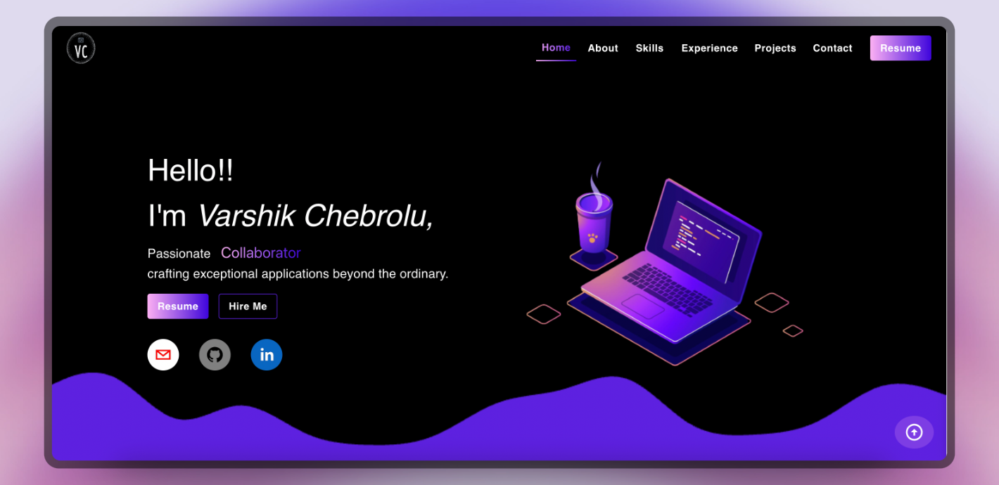

# My Portfolio

Welcome to my personal portfolio website built with React! 🌟 This space reflects my journey as a passionate web developer.

### 📋 Table of Contents

- [Features](#features)
- [Technologies Used](#technologies-used)
- [Installation](#installation)
- [Usage](#usage)
- [Project Structure](#project-structure)
- [Contributing](#contributing)

### ✨ Features

- Responsive design for a seamless experience on various devices.
- Engaging sections for an introduction, project showcase, skills, and easy contact.
- Smooth animations and interactive elements to captivate visitors.
- Detailed project descriptions with live/demo links for hands-on exploration.
- Contact form for seamless communication.

### 🛠 Technologies Used

- React
- React Router
- Styled Components (or your preferred styling library)
- [Additional libraries or tools you've used]

### 🚀 Installation

1. **Clone the repository:** git clone [repository-url]
2. **Navigate to the project directory:**cd my-react-portfolio
3. **Install dependencies:**npm install
   ▶Usage
   **Run the development server:**npm start
   **Open the browser and go to:**http://localhost:3006

### 🤝 Contributing

🎉 Open to Suggestions, feature ehancement and feel free to customize the content and visuals further according to your preferences!
